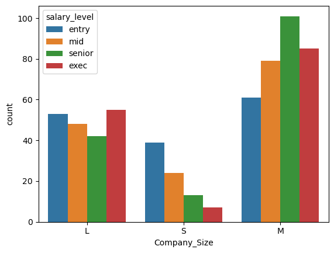

A veces los datos tal y como nos viene puede no aportarnos mucha información, el poder crear nuevas características (features) a partir de ellas puede ser de gran utilidad para un mejor análisis. Una de las formas de hacer esto es mediante la creación de nuevas categorías a partir de una columna numérica contínua, ya que al ser de alta cardinalidad podemos resumirlos en una nueva columna de baja cardinalidad.

Mediante `#!py pd.cut(x, bins, labels)` podemos convertir valores numéricos en categorías discretas.

```py linenums="1" hl_lines="3-10 13-15"

salary_labels = ["entry", "mid", "senior", "exec"] # labels

twenty_fifth = df_salarios["Salary_USD"].quantile(0.25)
salaries_median = df_salarios["Salary_USD"].quantile(0.5)
seventy_fifth = df_salarios["Salary_USD"].quantile(0.75)
salary_ranges = [0,
    twenty_fifth,
    salaries_median, 
    seventy_fifth, 
    df_salarios["Salary_USD"].max()] #(1)!

# Create salary_level
df_salarios["salary_level"] = pd.cut(df_salarios["Salary_USD"],
                                  bins=salary_ranges,
                                  labels=salary_labels) #(2)!

# Plot the count of salary levels at companies of different sizes
sns.countplot(data=df_salarios, x="Company_Size", hue="salary_level");
```
1. Se crea los intervalos que tenga en la misma proporción (25%) y mediante estos grupos creados se asigna una etiqueta a los trabajadores que pertenecen a esa nueva categoría.
2. Creamos las categorías discretas, mediante `pd.cut()`.

