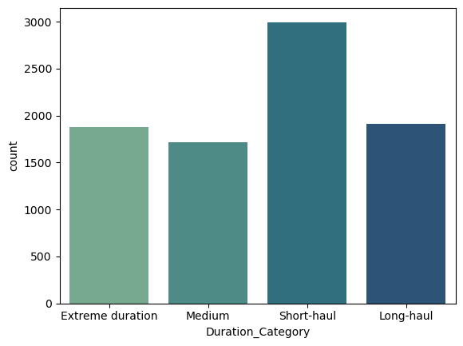

Es importante saber cómo trabajar con los datos de tipo categórico, nos puede dar información relevante para nuestro análisis.

Hay una gran importancia en que los datos categóricos sean de baja cardinalidad, las ventajas de estas son:
* Visualización más clara para los gráficos (barra, circular, etc.)
* Mejora en el rendimiento en modelos de Machine Learning
    * En la conversión de codificación `one-hot`
    * Menos overfitting, con menos categorías únicas, hay menos riesgo que el modelo aprenda patrones específicos por cada categoría.
* Menos consumo de memoria
* Agrupamientos y análisis más sencillos.

Por tal motivo, en caso de tener columnas con alta cardinalidad se recomienda agrupar por una categoría más general. Por ejemplo, si tiene una columna de dirección, podría trabajar con la ciudad o país.

!!! example "Trabajando con datos categóricos"
    Del mismo dataset con que se trabajó en el capítulo anterior, se seguirá. Verificar que los datos categóricos sean de baja cardinalidad, en caso de ser alta, transformarlo a uno de baja (si es posible).

```py hl_lines="1-3 6-9 11-15 17-19"
df_categoricos=df_planes.select_dtypes("object")
for n in df_categoricos:
    print(f"{n}: ", df_categoricos[n].nunique()) #(1)!

# Creamos nuevas categorías
flight_categories = ["Short-haul", "Medium", "Long-haul"]
short_flight = "^0h|^1h|^2h|^3h|^4h"
medium_flights = "^5h|^6h|^7h|^8h|^9h"
long_flight= "10h|11h|12h|13h|14h|15h|16h" #(2)!

condiciones = [
(df_categoricos["Duration"].str.contains(short_flights)),
(df_categoricos["Duration"].str.contains(medium_flights)),
(df_categoricos["Duration"].str.contains(long_flights))
] #(3)!

df_categoricos["Duration_Category"] = np.select(condiciones, 
                                        flight_categories,
                                        default="Extreme duration") #(4)!

sns.countplot(data=non_numeric, x="Duration_Category") #(5)!
```

1. Seleccionamos todas las columnas que son de tipo categórico (`#!py df_planes.select_dtypes(...)`). En el bucle se imprime la cantidad de valores únicos que se tiene en cada columna. Se puede ver que la columna `Duration` tiene muchos valores distintos, por lo que trabajaremos con esta para pasarlo a menor cardinalidad.

    |Columnas|Valores únicos|
    |------------|---------|
    |Airline          | 8 |
    |Date_of_Journey  | 44 |
    |Source           | 5 |
    |Destination      | 6 |
    |Route            | 122 |
    |Dep_Time         | 218 |
    |Arrival_Time     | 1220 |
    |Duration         | 362 |
    |Total_Stops      | 5 |
    |Duration_Category| 4 |

2. Se crea las nuevas categorías `#!py ["Short-haul", "Medium", "Long-haul"]`, para determinar si una fila está en el rango se utiliza los patrones que se indican, para un vuelo corto comenzará con `0h` (cero horas), `1h` (una hora), etc. Mediante `^` se indica que el siguiente caracter es como debe empezar, así evitamos confusiones como `11h, 21h, etc`.
3. Se crea `conmdiciones` una lista que continene valores `booleanos`, mediante `#!py str.contains()` se indica si en la fila hay un valor que contenga `short_flights`, `medium_flights`, o `long_flights`.
4. Se genera los valores para la nueva columna `Duration_Category`.
5. `#!py sns.countplot()` es el ideal para cuando solo queremos evaluar la cantidad de valores que tienen la misma categoría.
    


!!! info "np.select"
    La funcion `np.select(conditionList, choicesList, default=0)` se utiliza para seleccionar elementos de una lista (`choicesList`) en función de una lista de condiciones `conditionList`, se indica un `default` en caso que no se cumpla ninguna condición, por defecto es `0`. 
    
    `#!py np.select()` itera a través de las matrices (arrays) en `conditionList`. Para cada elemento en la posición `i`:
        * Se evalúa en la primera condición para la fila `i`, si es `#!py True` se toma el valor del elemento en la misma posición `i` de la matriz correspondiente en `choicesList`; si es `#!py False`, se sigue con la siguiente condición con la mismo posición `i`. En caso que todas las condiciones sean `#!py False`, entonces se retorna el valor de `default`

    Las condiciones no necesariamente deben ser excluyentes mutuamente, puede ser que para sea `True` en todas las condiciones, pero solo retornará el valor de la primera condición que cumpla.

!!! info "Función np.select vs np.where"
    Ambos evaluan una condición y retorna un valor, pero la diferencia radica en que `#!py np.select()` permite múltiples condiciones, si en caso se utiliza solo una condición, es mejor el uso de `#!py np.where()`