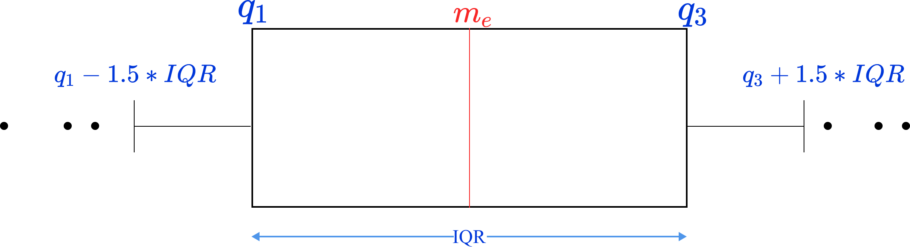
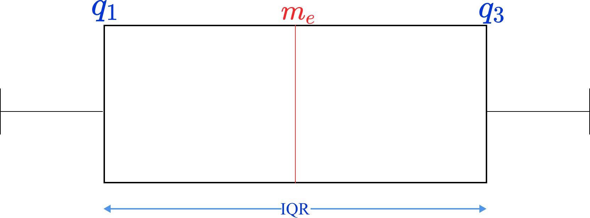
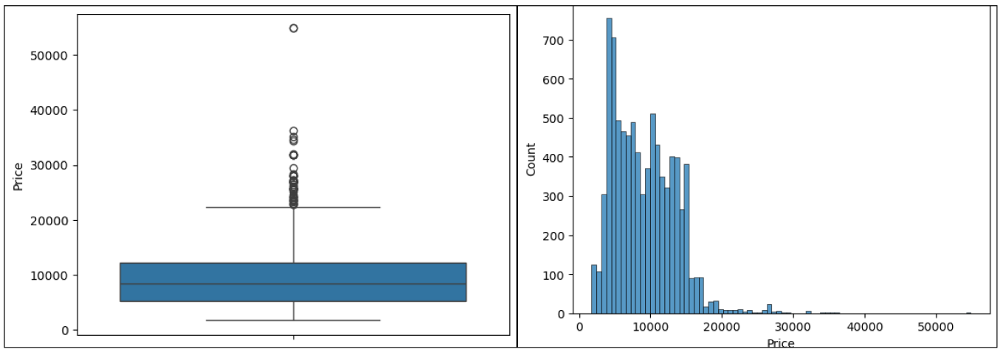
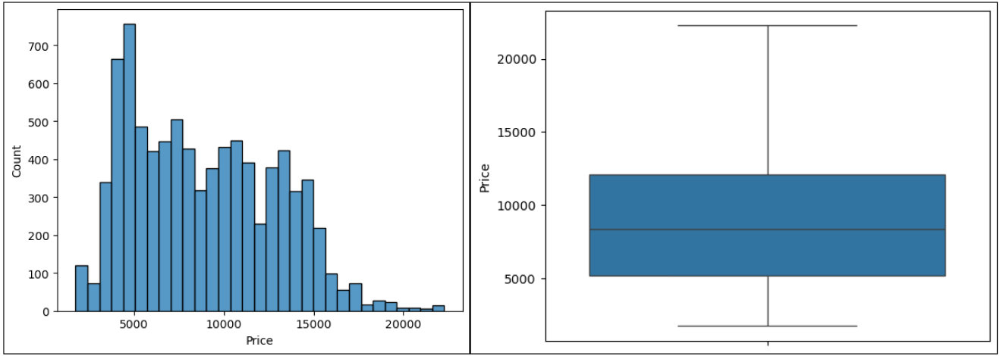

Los valores atípicos u outliers, son datos que se alejan mucho a los valores que son más representativos a nuestro conjunto de datos. Poder identificarlos es escencial para un poder luego trabajar con un modelo de Machine Learning, ya que estos valores sueles sesgar el modelo.

Una de las formas de saber si un conjunto de datos tiene valores atípicos es mediante el `Boxplot`.

## Boxplot

El gráfico de caja y bigote ayuda a ver la distribución de los datos, además de saber si hay valores atípicos. No nos indica la densidad de los datos o la cantidad exacta de los datos.

### Caja

De nuestro conjunto de datos, se ordena de forma ascendente y mediante cuartiles se separa los datos y se toma 3 valores (25%, 50%, 75%).



Si nos fijamos bien en la imagen, podemos observar que la mediana no está en la mitad de la caja, está más a la izquierda, no es simétrica. Esto indica que, los valores a la izquierda de la mediana son más cercanas (menos dispersos) que los valores a la derecha de la mediana. Si bien en ambos lados existen dos números, estos se diferencia en su separación entre ambos grupos. Del gráfico, se puede decir que está sesgado a la derecha, hay valores más separados por el lado derecho.

$q_1$ y $q_3$ son el primer y tercer percentil, respectivamente, $q_1$ indica que el $25\%$ de los datos son menores a $q_1$. Mientras que, $q_3$ indica que el $75\%$ es menor a $q_3$. El cálculo de ambos son la mediana de los valores restantes de los dos grupos que se forman a separar por la mediana.

### Bigote
Indica los límites de la distribución, los que superan este límite son considerados como valores atípicos.



Este tipo de cálculos pueden diferir a la hora de trabajar con `numpy, matplotlib, seaborn` ya que se puede aplicar diferentes tipos de interpolación.

```py

sns.boxplot(data=df_planes, y="Price")
sns.histplot(df_planes["Price"])
```



```py
def eliminar_outliers(df, columna):
    q1=df[columna].quantile(0.25)
    q3=df[columna].quantile(0.75)
    iqr=q3-q1
    lower=q1-1.5*iqr
    upper=q3+1.5*iqr

    df_filtrado = df[(df[columna]>=lower) & (df[columna]<=upper)]
    return df_filtrado[columna]

price_clean=eliminar_outliers(df_planes, "Price")
sns.boxplot(price_clean)
sns.histplot(price_clean)
```

