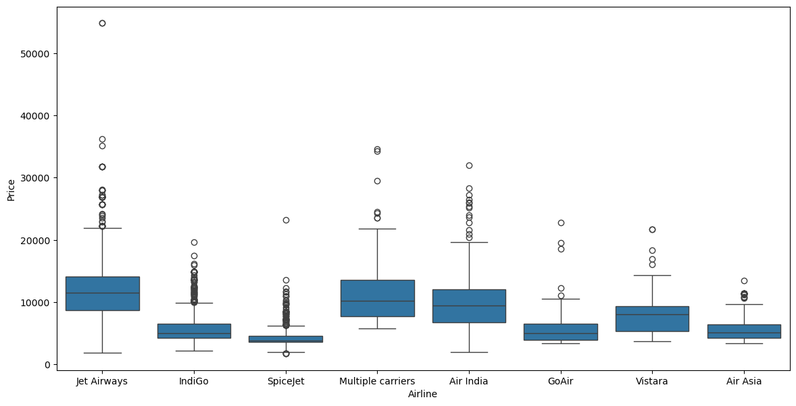

Hay varias formas de trabajar con datos faltantes en nuestro conjunto de datos. Para poder decidir cómo tratar con estos datos, primero debemos saber su impacto en nuestro análisis.

## Eliminación de datos faltantes

Si la cantidad de datos faltantes es menor al $5\%$ del total de los datos, entonces se podría elimnar dicha fila que lo contiene.

```py
    import pandas as pd
    
    df_planes=pd.read_csv("./planes.csv")
    df_planes.isna().sum() #(1)!

    threshold = len(df_planes)*0.05 #(2)!

    columnas_poco_nan=df_planes.columns[df_planes.isna().sum()<=threshold] #(3)!

    df_planes.dropna(subset=columnas_poco_nan, inplace=True) #(4)!
```

1. Mediante este método podemos ver la cantidad de valores NaN en cada columna.

    |columnas |cantidad faltantes|
    |------------------|-----|
    | Airline          | 427 |
    | Date_of_Journey  | 322 |
    | Source           | 187 |
    | Destination      | 347 |
    | Route            | 256 |
    | Dep_Time         | 260 |
    | Arrival_Time     | 194 |
    | Duration         | 214 |
    | Total_Stops      | 212 |
    | Additional_Info  | 589 |
    | Price            | 616 |

2. Indicamos el límite (5% de los datos) de datos faltantes que pueden tener cada columna, los que son menor o igual a esto se puede eliminar dichas filas, si son mayores no los eliminamos, `533.0`.
3. Mediante el método `#!py .columns()` podemos saber el nombre de las columnas que cumplen con la condición.

    |    Columnas     |
    |-----------------|
    | Airline         | 
    | Date_of_Journey | 
    | Source          | 
    | Destination     | 
    | Route           | 
    | Dep_Time        |    
    | Arrival_Time    |     
    | Duration        | 
    | Total_Stops     | 

4. Eliminamos las filas de las columnas donde su valores nulos son menor o igual al 5% de la cantidad total, dicho resultado se aplicará al dataframe.

    |  columnas| valores NaN |
    |------------------|-----|
    | Airline          |    0|
    | Date_of_Journey  |    0|
    | Source           |    0|
    | Destination      |    0|
    | Route            |    0|
    | Dep_Time         |    0|
    | Arrival_Time     |    0|
    | Duration         |    0|
    | Total_Stops      |    0|
    | Additional_Info  |  300|
    | Price            |  368|

## Eliminación de columnas

Si la cantidad de valores faltantes en una columna supera el $70\%$ u $80\%$, entonces una buena opción sería la eliminación de dicha columna. Ya que eliminar las filas afectaría a las demás columnas, o si se desea imputar, por tan poca información, respecto al dataset general, no podría hacerse una buena aproximación.

```py
    df_planes['Additional_Info'].value_count()/len(df_planes)*100 #(1)!

    df_planes=df_planes.drop(columns='Additional_Info') #(2)!
```

1. Se calcula el porcentaje de datos faltantes para la columna.

    |Additional_Info              | % faltantes|
    |-----------------------------|-----------| 
    |No info                      | 75.211566 | 
    |In-flight meal not included  | 17.924307 | 
    |No check-in baggage included |  3.032440 | 
    |1 Long layover               |  0.164551 | 
    |Change airports              |  0.082276 | 
    |No Info                      |  0.023507 | 
    |Business class               |  0.011754 | 
    |Red-eye flight               |  0.011754 | 
    |2 Long layover               |  0.011754 |

2. Como hay un 75% de datos faltantes (No info), se elimina la columna mediante `#!py .drop()`

## Imputación de datos

Para poder imputar los datos mediante una medida de tendencia central (media, mediana y moda), se debe tener en cuenta lo siguiente:

* Son datos categóricos -> Imputar por la **Moda**
* Son datos numéricos con muchos outliers -> Imputar por la **Mediana**
* Son datos numéricos simétricos o pocos outliers -> Imputar por la **Media**

Ayuda mucho usar los gráficos de caja para determinar si se usará la **Media** o **Mediana**

```py
plt.figure(figsize=[14, 7]) #(1)!
sns.boxplot(data=df_planes, x='Airline', y='Price') #(2)!

airline_prices = df_planes.groupby("Airline")["Price"].median() #(3)!

prices_dict = airline_prices.to_dict() #(4)!

df_planes["Price"]=df_planes["Price"].fillna(
    df_planes["Airline"].map(prices_dict)
    ) #(5)!
```

1. Configuramos el tamaño del gráfico, para poder ver con mayor claridad
2. Graficamos mediante un boxplot la distribución de los precios por cada Airline.
    
3. Como se puede ver en la gráfica, hay muchos outliers lo que afectaría a la media, entonces se utiliza la mediana.
4. Transformamos los valores a diccionario.
5. Se "rellena" (imputa) los valores `NaN`, mediante `#!py fillna()`.
    * `#!py df_planes["Airline"].map(prices_dict)`: Todos los valores de la columna `Airline` que coincen con la clave que está en el diccionario, se reemplaza con el valor del diccionario, esto se logra gracias al método `#!py map()`


!!! note "La importancia de .map()"
    El uso de `#!py .map() + .fillna()` es el más óptimo, ya que permite trabajar en vectores, a diferencia de hacerlo con `#!py .apply()` que se itera fila por fila.