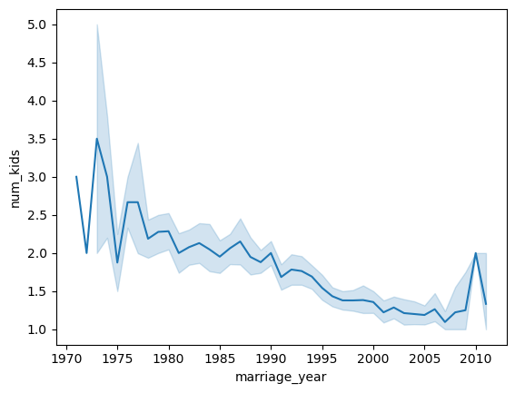

Poder realizar análisis que se repiten o evolucionan a lo largo de un periodo de tiempo es fundamental para muchas áreas. Esta sección abarcará los primeros pasos para poder trabajar con tiempo.

Se trabajará con los siguientes datos

| divorce_date | dob_man   | education_man| income_man|    dob_woman   | education_woman|income_woman|marriage_date|marriage_duration| num_kids |
|--------------|-----------|--------------|-----------|----------------|----------------|------------|-------------|-----------------|----------|
| 2006-09-06   |1975-12-18 | Secondary    |  2000.0   |   1983-08-01   |   Secondary    | 1800.0     | 2000-06-26  | 5.0             | 1.0      |
| 2008-01-02   |1976-11-17 | Professional |  6000.0   |   1977-03-13   |   Professional | 6000.0     | 2001-09-02  | 7.0             | NaN      |
| 2011-01-02   |1969-04-06 | Preparatory  |  5000.0   |   1970-02-16   |   Professional | 5000.0     | 2000-02-02  |  2.0            | 2.0      |
| 2011-01-02   |1979-11-13 | Secondary    |  12000.0  |   1981-05-13   |   Secondary    | 12000.0    | 2006-05-13  |  2.0            | NaN      |
| 2011-01-02   |1982-09-20 | Professional |  6000.0   |   1988-01-30   |   Professional | 10000.0    | 2007-08-06  |  3.0            | NaN      |


```py linenums="1" hl_lines="1-2 4-5 7-10"
df_divorcios=pd.read_csv("Data Transformation/Datasets/EDA/divorce.csv", 
    parse_dates=["divorce_date", "marriage_date"]) #(1)!

df_divorcios["dob_man"]=pd.to_datetime(df_divorcios["dob_man"])
df_divorcios["dob_woman"]=pd.to_datetime(df_divorcios["dob_woman"]) #(2)!

df_divorcios["marriage_year"]=df_divorcios["marriage_date"].dt.year
df_divorcios["marriage_year"]
sns.lineplot(x=df_divorcios["marriage_year"],y=df_divorcios["num_kids"]);#(3)!
```

1. Se importa los datos del archivo `.csv`, indicando que las columnas `divorce_date` y `marriage_date` son de tipo fecha.
2. Nos podemos dar cuenta que también las columnas `dob_man` y `dob_woman` (dob: date of birthday) son columnas de tipo fecha.
    * `#!pypd_to_datetime(...)`: Permite convertir solo una columna a tipo fecha.

    | #   | Column            | Non-Null Count  | Dtype          |
    | --- |  ------           |  -------------- |  -----         | 
    | 0   | divorce_date      | 2209 non-null   | datetime64[ns] |
    | 1   | dob_man           | 2209 non-null   | datetime64[ns] |
    | 2   | education_man     | 2205 non-null   | object         |
    | 3   | income_man        | 2209 non-null   | float64        |
    | 4   | dob_woman         | 2209 non-null   | datetime64[ns] |
    | 5   | education_woman   | 2209 non-null   | object         |
    | 6   | income_woman      | 2209 non-null   | float64        |
    | 7   | marriage_date     | 2209 non-null   | datetime64[ns] |
    | 8   | marriage_duration | 2209 non-null   | float64        |
    | 9   | num_kids          | 1333 non-null   | float64        |

3. Creamos una columna `marriage_year` que contiene solo el año de la fecha del matrimonio, esto se consigue mediante `#!py df_divorcios["marriage_date"].dt.year`, cabe recalcar que también se puede extraer el mes (`month`) y día(`day`).



!!! info "Otros métodos"
    Si se tuviese tres columnas que representen el **año**, **mes** y **día**, se puede unir para que crear una sola columna de tipo `datetime64[ns]`, esto se logram mediante `#!py pd.datetime(df[year, month, day])`. Es importante saber que, el nombre de las columnas deben ser `year`, `month` y `day`.
