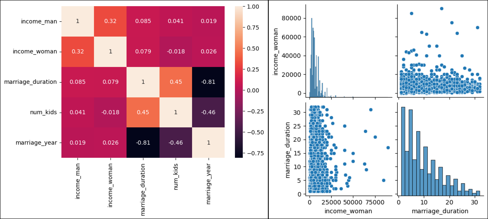

La correlación entre variables nos indica qué tan relacionadas están ambas variables, el más popular es la **Correlación de Pearson**, este nos indica mediante un valor numérico si existe una fuerte relación lineal entre dos variables, siendo $-1$ una fuerte relación inversa (si uno aumenta, el otro disminuye), $0$ no tiene relación y $+1$ una fuerte relación. La correlación solo se aplica para datos de tipo numérico.

```py
divorcios_number=df_divorcios.selecte_dtypes("number")
divorcios_number.corr() #(1)!

# Gráficamente
sns.heatmap(divorcios_number.corr(), annot=True)

# Ver gráficamente (pairplot) entre dos variables o más.
sns.pairplot(divorcios_number, vars=["income_woman", "marriage_duration"])
```

1. Se puede ver la correlación entre las variables de forma numérica.

    |                   | income_man |income_woman |marriage_duration| num_kids   | marriage_year |
    |-------------------|------------|-------------|-----------------|------------|---------------|
    | income_man        | 1.000000   |  0.318047   |   0.085321      |  0.007948  |  0.019170     |
    | income_woman      | 0.318047   |  1.000000   |   0.078677      | -0.004515  |  0.026433     |
    | marriage_duration | 0.085321   |  0.078677   |   1.000000      |  0.574067  | -0.812469     |
    | num_kids          | 0.007948   | -0.004515   |   0.574067      |  1.000000  | -0.573212     |
    | marriage_year     | 0.019170   |  0.026433   |  -0.812469      | -0.573212  |  1.000000     |

