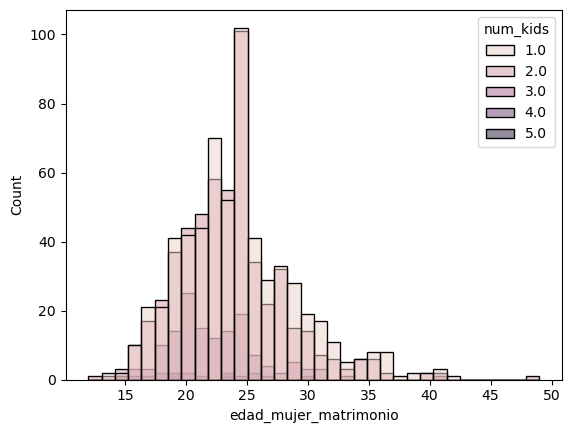
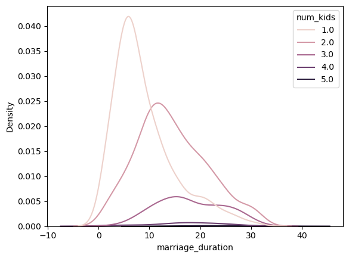

Puede ser muy complicado poder transformar los datos categóricos para tener una representación numérica y saber su relación entre estas varibles, una mejor opción y rápida es ver su distribución y relación mediante gráficas individuales.

Existe dos formas de ver su distribución, uno es mediante el **histograma**; sin embargo, cuando se trata con varias variables se dificulta la visualización. La segunda opción es mediante **Estimación de Densidad de Kernel (KDE por sus siglas en inglés)**, nos muestra una estimación suavizada de la distribución de los datos, el valor más alto del eje Y indica que hay más datos concentrados alrededor del valor del eje X, pero no indica un valor fijo, no indica la cantidad para un punto dato, ni la frecuencia.

```py
# Edad (años) en que las mujeres se casaron
df_divorcios["edad_mujer_matrimonio"] = (df_divorcios["marriage_date"].dt.year 
    - df_divorcios["dob_woman"].dt.year) #(1)!

sns.histplot(data=df_divorcios, x="edad_mujer_matrimonio", hue="num_kids") #(2)!
```
1. Mediante `.dt.year` obtenemos solo el año.
2. Visualizamos la distribución entre la edad de matrimonio, por cada cantidad de hijos



```py
# Gráfica de KDE
sns.kdeplot(data=df_divorcios, x="marriage_duration", hue="num_kids") #(1)!

```
1. El KDE nos indica la concentración que hay alrededor de un punto, además nos permite visualizar la forma de la distribución de los datos, saber si sigue una distribución gaussiana o no. Cabe recalcar que, los valores del eje Y representa la densidad de probabilidad.



!!! success "La importancia del KDE"
    Además de lo explicado anteriormente, el KDE nos permite saber si tenemos un desbalance en nuestro datos, cuando una curva es plana y baja, esto indica dos cosas o hay muy pocos datos para dicha categoría o los datos están muy dispersos, esto lo puede comprobar mediante el método `.value_counts()`. Es importante tener en cuenta esto si desea crear un modelo de predicción ya que un desbalance de datos podría traer un sesgo en la predicción, problemas de sobreajustes para las categorías con pocas muestras.

    De la última gráfica, podemos ver que para los divorcios con 4 y 5 hijos, sus gráficas son casi planas y bajas (se nota más para el caso de 5 hijos), por lo que nuestro conjunto de datos no nos da mucha información para estos casos.