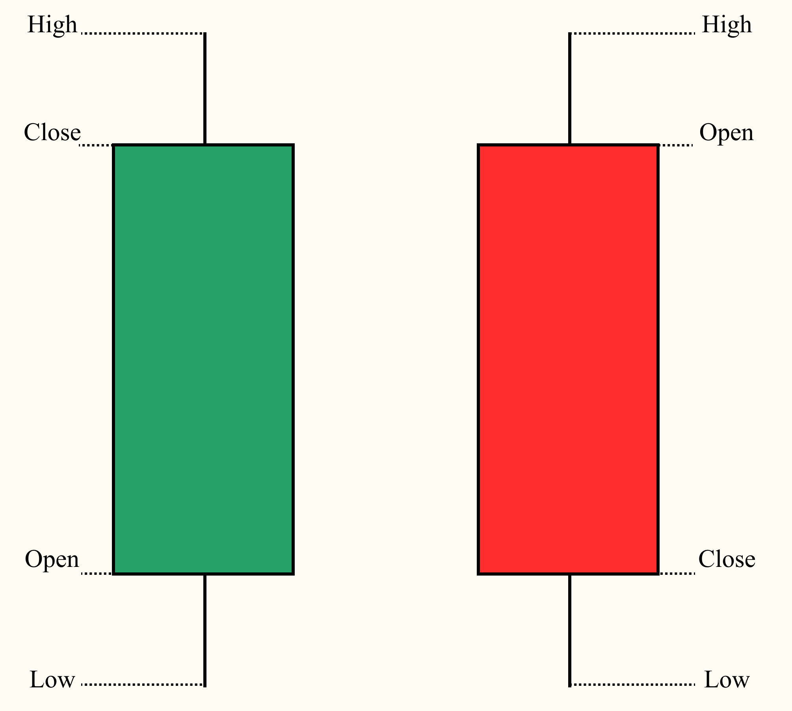

El **Riesgo financiero** es una medida de la incertidumbre de los rendimientos futuros, es decir, es la dispersión o varianza de los rendimientos.

## Tipos de rendimientos

### Rendimiento Discreto

Es el cambio porcentual en el precio de un activo en un periodo determinado

$$RD=\frac{P_{final} - P_{inicial}}{P_{inicial}}$$

### Rendiemiento Logarítmico

Es el logaritmo natural del cambio en el precio de un activo

$$RL=\ln(\frac{P_{final}}{P_{inicial}})$$

## Rendimiento Discreto vs Rendimiento Logarítmico

Uno de los aspectos que diferencia ambos tipos de rendimiento es el cálculo del rendimiento total, la aditividad de los rendimientos para cada periodo hasta llegar al final.

### Rendimiento Total para RD

Si queremos calcular el rendimiento total bimestral, teniendo el rendimiento por cada mes:

* $P_1=100\%$
* $P_2=-50\%$

A simple induición diríamos que el rendimiento total es la suma de los rendimientos de los periodos, si es así, entonces el rendimiento total sería

$$RD_{Total}=P_1+P_2=50\%$$

Si nuestro capital inicial es de $\$/.100.00$, entonces al final tendríamos $\$/. 150.00$.

Para comprobar, vamos a calcular periodo por periodo, sabemos que,

$$RD=\frac{P_{final} - P_{inicial}}{P_{inicial}} \rightarrow P_{final}=(RD+1)*P_{inicial}$$

* Periodo 1: $P_{1}=(100\%+1)*100 = \$200.00$
* Periodo 2: $P_{2}=(-50\%+1)*200 = \$100.00$

Como vemos, tenemos nuestro capital final (periodo 2) que indica que es $\$100.00$. Pero nuestro capital inicial es de $\$100.00$, entonces el rendimiento final no es del $50\%$ como se calculó anteriormente, sino que es del $0\%$. Nos podemos dar cuenta que el **Rendimiento Discreto Total no es aditivo**. Esto se debe a que el precio, monto, capital, base cambia por cada periodo, por lo que la suma no es el correcto, es un cálculo compuesto.

$$RD_{Total}=(1+RD_1)(1+RD_2)(...) - 1$$

Calculando el Rendimiento Discreto Total, mediante esta última fórmula:

$$RD_{Total}=(1+100\%)(1-50\%) - 1 = 0$$

### Rendimiento Total para RL

Supongamos que el Rendimiento Total es mediante la suma de los rendimientos de sus periodos, entonces

$$RL_{Total}=\ln(\frac{P_{final}}{P_{intermedio}}) + \ln(\frac{P_{final}}{P_{intermedio}})$$

$$RL_{Total}=\ln(\frac{P_{final}}{P_{intermedio}}*\frac{P_{intermedio}}{P_{inicial}})$$

$$RL_{Total}=\ln(\frac{P_{final}}{P_{inicial}})$$

Como vemos, sí tiene sentido, en este caso no está el problema con los precios, montos, capitales intermedios ya que esto se eliminan al ser sumados para obtener el **Rendimiento Total**.

Tomando los valores del ejemplo anterior:

$$RL_{Total}=\ln({200}{100}) + \ln({100}{200}) = 0.6931 - 0.6931 = 0$$

Entonces, sumando los rendimientos de los periodos nos arroja un resultado del $0\%$ como **Rendimiento Logaritmico Total**.

## Datos OHCLV

Este tipo de datos se presenta comúnmente en el campo de finanzas, específicamente en bolsa de valores, criptomonedas, etc. Estas siglas representan a **Open, High, Close, Low, Volume**:

* Open: Es el precio de apertura de un periodo determinado (como por año, semana, día, 15min, 1min, etc.)
* High: Es el precio más alto alcanzado durante el periodo.
* Low: Es el precio más bajo que se alcanza durante el periodo.
* Close: Es el precio cuando se terminó el periodo.
* Volume: Es el volumen de transacciones, número total de unidades del activo que se negociaron durante el periodo seleccionado. Representa cuantas acciones, monedas o contratos cambiaron de mano durante el periodo.

Gráficamente se utiliza en las **Velas Japonesas**, ya que estas contienen estos cincos términos



!!! info "Adjusted Close"
    El **precio de cierre ajustado** es el que se obtiene luego de realizar ajustes por:
    * Dividendos
    * Divisiones de acciones (Splits): Ocurre cuando el precio de una acción es muy alta y la empresa desea dividir para que sea más accesible a inversores minoristas.
    * Otros eventos corporativos
    
    Este precio es con el que se debe realizar el análisis financiero y cálculo de retornos

## Ejemplos

Se estará trabajando con los siguientes datos:

|       Date |   Open |   High |    Low |    Close |   Volume |  Adjusted |
|------------|--------|--------|--------|----------|----------|-----------|
| 2000-01-03 | 88.777 | 89.722 | 84.712 | 58.28125 | 53228400 | 38.527809 |
| 2000-01-04 | 85.893 | 88.588 | 84.901 | 56.31250 | 54119000 | 37.226345 |
| 2000-01-05 | 84.050 | 88.021 | 82.726 | 56.90625 | 64059600 | 37.618851 |
| 2000-01-06 | 84.853 | 86.130 | 81.970 | 55.00000 | 54976600 | 36.358688 |
| 2000-01-07 | 82.159 | 84.901 | 81.166 | 55.71875 | 62013600 | 36.833828 |


```py hl_lines="1-2 4-5 7-8"

df = df.set_index("Date")
df = df.sort_values("Date") #(1)!

df["RC"] = df["Adjusted"].pct_change()
df["RC_Acumulativo"] = (1 + df["RC"]).cumprod() - 1 #(2)!

df["RL"] = np.log(df["Adjusted"]/df["Adjusted"].shift(1)) 
df["RL_Acumulativo"] = df["RL"].cumsum() #(3)!
```

1. Estos métodos son importantes de aplicar desde un inicio cuando se quiere calcular los Retornos, colocar como índice a la columna `Date` y ordenarlo de forma ascendente respecto al índice.
2. 
    * `#!py .pct_change()`: Se utiliza para calcular el rendimiento discreto, en fracción no en %.
    * `#!py .cumprod()` Se utiliza para calcular la suma acumulativa del producto del término que está a la izquierda.
3. 
    * `#!py .shift(1)`: Es el logarítmo natural del precio actual y el precio anterior.
    * `#!py .cumsum()`: Permite calcular la suma acumulativa.

|            |  Adjusted |        RC | RC_Acumulativo |        RL | RL_Acumulativo |
|------------|-----------|-----------|----------------|-----------|----------------|
| 2000-01-03 | 38.527809 |       NaN |            NaN |       NaN |            NaN |
| 2000-01-04 | 37.226345 | -0.033780 |      -0.033780 | -0.034364 |      -0.034364 |
| 2000-01-05 | 37.618851 |  0.010544 |      -0.023592 |  0.010489 |      -0.023875 |
| 2000-01-06 | 36.358688 | -0.033498 |      -0.056300 | -0.034072 |      -0.057947 |
| 2000-01-07 | 36.833828 |  0.013068 |      -0.043968 |  0.012983 |      -0.044964 |
| ...        |       ... |       ... |            ... |       ... |            ... |
| 2018-02-12 | 88.713272 |  0.010773 |       1.302578 |  0.010716 |       0.834029 |
| 2018-02-13 | 89.410004 |  0.007854 |       1.320662 |  0.007823 |       0.841852 |
| 2018-02-14 | 90.809998 |  0.015658 |       1.356999 |  0.015537 |       0.857389 |
| 2018-02-15 | 92.660004 |  0.020372 |       1.405016 |  0.020168 |       0.877557 |
| 2018-02-16 | 92.000000 | -0.007123 |       1.387886 | -0.007148 |       0.870408 |

## Distribución

Para poder entender la distribución es importante saber 4 conceptos.

* **Media** ($\mu$): Es el promedio de los datos
* **Varianza** ($\sigma^2$): La variabilidad de los datos ($\sigma$ es la volatilidad)
* **Asimetría** (Skewness): Es el sesgo que experimenta la distribución
* **Kurtosis**: Es la relación entre la altitud y la amplitud de la distribución, ayuda a entendersi los datos son más o menos propensos a generar valores extremos.

Teniendo en cuenta que la **Distribución Normal Estándar** tiene las siguientes características:

$$$$