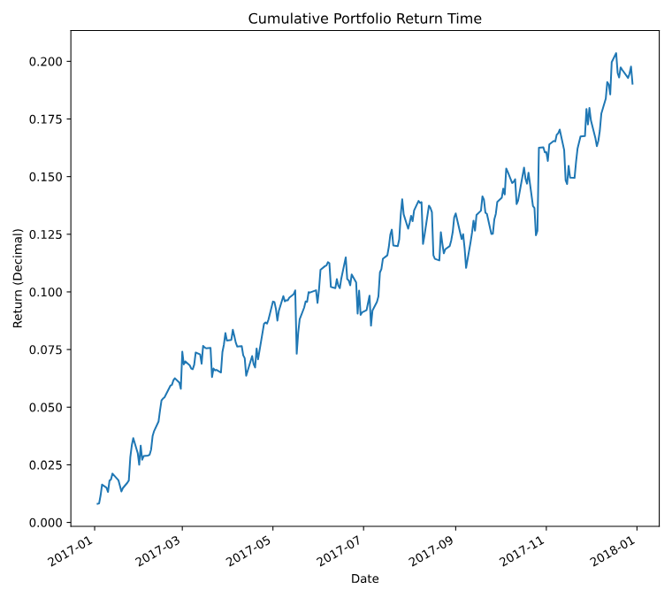
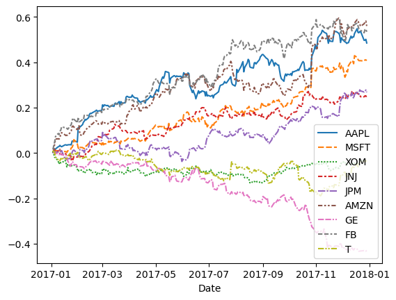
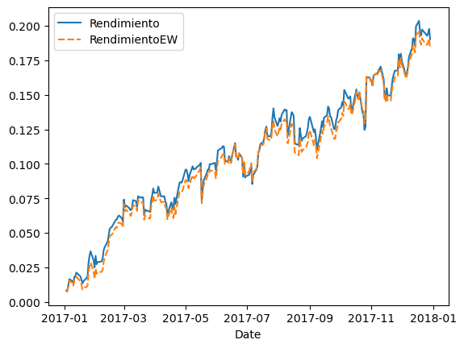
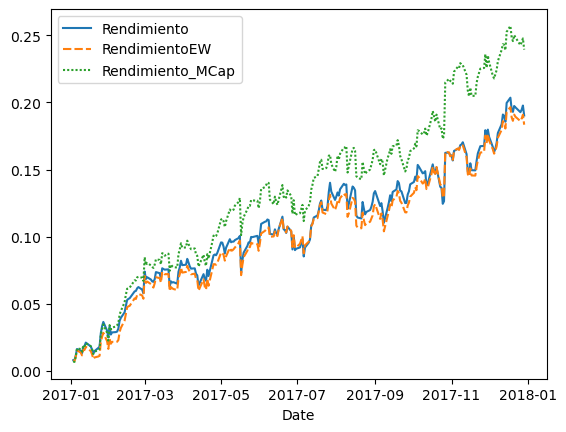

El portafolio (cartera) es un conjunto de activos financieros de diferentes empresas que puede tener un inversionista, pueden ser:
* Acciones
* Bonos
* Fondos de inversión
* Criptomonedas
* Divisas
* Bienes raíces

El objetivo de una cartera es poder maximizar las ganancias y minimizar el riesgo. Se gestiona a través de diversificación, que consiste en invertir en varios activos para reducir la exposición a pérdidas significativas.

## Backtesting

El Backtesting es una técnica que se utiliza para probar la efectividad de una estrategia de inversión, simulando cómo habría funcionado en el pasado.

* Se define la estrategia de inversión
* Se aplican los datos históricos del mercado
* Se analizan los resultados
    * Rendimiento potencial
    * Riesgo
    * Rentabilidad ajustada al riesgo

## Pesos

En un portalio al haber varios activos financieros, es importante saber cuál es el peso de cada uno, su cálculo no es más que la proporción que tiene un activo con el total de los activos. Por ejemplo, si tiene dos acciones, uno $/. 5000.00 en `AAPL` y $/. 3000.00 `MSFT`, entonces el peso de `APPL` es 0.625 y de `MSFT` es 0.375.

Es importante saber el peso de cada activo de nuestra cartera, ya que este nos ayuda a controlar el riesgo que se está asumiendo en cada tipo de activo. Mediante los pesos podemos realizar un **Rebalanceo**; por ejemplo, si tenemos un activo con un peso de 50% a 70%, entonces debemos de mover nuestro capital de este activo, ya que en caso de haber una caída significativa en ese activo, nos perjudicaría en gran medida.

## Ejemplo

Se trabajará con los siguientes datos:

|       Date |      AAPL |      MSFT |       XOM |       JNJ |       JPM |     AMZN |        GE |       FB |         T |
|------------|-----------|-----------|-----------|-----------|-----------|----------|-----------|----------|-----------|
| 2017-01-03 |  0.002849 |  0.007081 |  0.006980 |  0.005468 |  0.010894 | 0.005068 |  0.002848 | 0.015732 |  0.011521 |
| 2017-01-04 | -0.001119 | -0.004474 | -0.011002 | -0.001640 |  0.001844 | 0.004657 |  0.000316 | 0.015660 | -0.005811 |
| 2017-01-05 |  0.005085 |  0.000000 | -0.014907 |  0.010463 | -0.009205 | 0.030732 | -0.005678 | 0.016682 | -0.002806 |
| 2017-01-06 |  0.011148 |  0.008668 | -0.000565 | -0.004792 |  0.000116 | 0.019912 |  0.002855 | 0.022707 | -0.019924 |
| 2017-01-09 |  0.009159 | -0.003183 | -0.016497 | -0.000172 |  0.000697 | 0.001168 | -0.004745 | 0.012074 | -0.012585 |

| Company Name	     | Ticker | Portfolio Weight |
|--------------------|--------|------------------|
| Apple              | AAPL	  |       12%        |
| Microsoft          | MSFT	  |       15%        |
| Exxon Mobil        | XOM    |       8%         |
| Johnson & Johnson	 | JNJ    |       5%         |
| JP Morgan          | JPM    |       9%         |
| Amazon             | AMZN   |       10%        |
| General Electric   | GE     |       11%        |
| Facebook           | FB     |       14%        |
| AT&T               | T      |       16%        |

```py
portafolio = portafolio.sort_values("Date")
portafolio=portafolio.set_index("Date") #(1)!

pesos_portafolio=[0.12, 0.15, 0.08, 0.05, 0.09, 0.10, 0.11, 0.14, 0.16]

RendimientoPeso = portafolio @ pesos_portafolio #(2)!

portafolio["Rendimiento"]=RendimientoPeso

RendimientoAculativo = (1+RendimientoPeso).cumprod()-1 #(3)!

RendimientoAculativo.plot()
```

1. Como se indicó en el capítulo anterior, tenemos que tener como índice a la columna fecha y que esté ordenada ascendentemente.
2. El operador `@` permite la multiplicación de matrices o arrays, entrega un solo valor por cada fila. Multiplica el peso por el rendimiento que se tuvo en el día, suma cada uno de los resultados de cada activo y nos entrega un rendimiento diario de la cartera.
3. Esto se vió en el capítulo anterior, es el cálculo del rendimiento discreto acumulativo.



Qué hubiera pasado si solo hubieramos invertido en un solo activo



!!! success "Efecto de los pesos en nuestro portafolio"
    Tener una cartera balanceada nos ayuda a disminuir el riesgo de perder todo, esto también afecta al beneficio, si tenemos un monto pequeño en una activo y este activo crece drásticamente, su impacto en nuestra cartera será poca ya que tenemos muy poco capital en este activo, pero esto también nos beneficia en caso que un activo cae drásticamente. En esta última imagen podemos ver cómo empresa como **Apple** y **Amazon** tuvieron un beneficio alrededor del 50%, pero también empresas como **General Electric** tuvieron una gran caída, si solo hubieramos invertido en esta empresa hubieramos tenido una pérdida del 42%.

## Pesos iguales como referencia

Una de las formas que podemos comparar nuestra estrategia, es compararlo con una estrategia donde la cartera tiene un pesos igual para todos los activos, veamos cómo sería.

```py hl_lines="4-9"
pesos_iguales=np.repeat(1/9, 9) #(1)!
portafolio["RendimientoEW"]=portafolio.iloc[:,:9] @ pesos_iguales #(2)!

def cumulative_returns_plot(df, col1, col2, col3=None):
    df2=pd.DataFrame()
    df2[col1]=(1+df[col1]).cumprod()-1
    df2[col2]=(1+df[col2]).cumprod()-1
    if col3:
        df2[col3]=(1+df[col3]).cumprod()-1

    sns.lineplot(df2) #(3)!

cumulative_returns_plot(portafolio, "Rendimiento", "RendimientoEW") #(4)!
```

1. Creamos una array con 9 elementos del mismo valor (1/9), estos serían los pesos de nuestro portafolio.
2. Seleccionamos las primeras 9 columnas con todas sus filas para realizar el cálculo del nuevo rendimiento, hay que tener en cuenta que hay una nueva columna que es `Rendimiento` que se calculó en el ejemplo de arriba.
3. Creamos una función que nos permite graficar dos columnas.
4. Utilizando la función que hemos creado, graficamos ambos rendimientos.




## Portafolios ponderadas por capitalización de mercado

Una estrategia muy utilizada es que los pesos no lo determinemos nosotros, sino que sea proporcial a la capitalización de cada empresa. Esta misma estrategia lo utiliza el indicador **S&P 500**.

| Company Name      |  Ticker |  Market Cap ($ Billions) |
|-------------------|---------|--------------------------|
| Apple             |  AAPL   |  601.51                  |
| Microsoft         |  MSFT   |  469.25                  |
| Exxon Mobil       |  XOM    |  349.50                  | 
| Johnson & Johnson |  JNJ    |  310.48                  |
| JP Morgan         |  JPM    |  299.77                  |
| Amazon            |  AMZN   |  356.94                  |
| General Electric  |  GE     |  268.88                  |
| Facebook          |  FB     |  331.57                  |
| AT&T              |  T      |  246.09                  |

```PY
market_capitalizations = np.array([601.51, 469.25, 349.5, 310.48, 299.77,
                                   356.94, 268.88, 331.57, 246.09]) #(1)!

mcap_weights = market_capitalizations/market_capitalizations.sum() #(2)!

portafolio["Rendimiento_MCap"] = portafolio.iloc[:,:9] @ mcap_weights

cumulative_returns_plot(portafolio, "Rendimiento", "RendimientoEW", "Rendimiento_MCap")
```

1. Creamos nuestro array con la capitlización de mercado de cada empresa
2. Ponderamos los valores, respecto al total.

