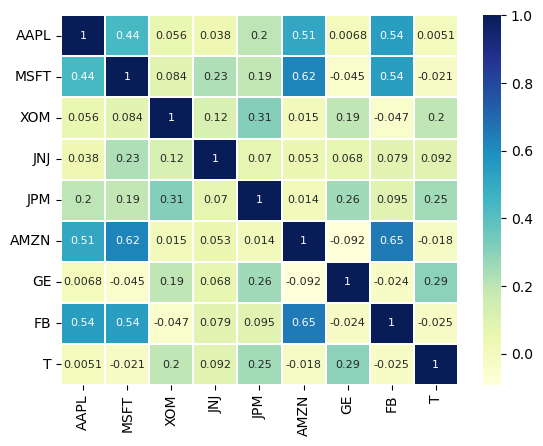

La covarianza mide si dos variables tienen el mismo sentido o dirección, es decir, si una variable aumenta, la otra también aumentará, o si uno aumenta la otra disminuirá (diferente dirección). Veamos:

* Covarianza positiva: Las variables se mueven en la misma dirección.
* Covarianza negativa: Las variables se mueven en dirección opuesta.

Sin embargo, la covarianza por sí sola no nos indica qué tan relacionada están ambas variables, aquí entra en juego la **Correlación de Pearson**, que no es más que la normalización de la **covarianza**.

* Correlación -> +1: Alta relación, se mueven en la misma dirección.
* Correlación -> 0: Sin relación.
* Correlación -> -1: Alta relación opuesta, se mueven de dirección contraria.

En el ámbito financiero, la alta correlación positiva en activos no es una buena señal para nuestro portafolio, esto es debido a que si por algun contexto político, social o económico, hay una caída en nuestro activo, al estar todas relacionadas (en el mismo sentido) entonces todos nuestros rendimientos caerá. Por tal motivo, se recomienda tener carteras diversificadas y para esto nos ayudará la correlación.

Veamos el caso del índice bursátil **S&P 500**, tiene las 500 empresas más grandes de los EE.UU respecto a su capitalización en el mercado, donde hay empresas de varios rubros (diversificado), tecnológicas, energéticas, inmobiliarias, salud, financiero, etc. Este índice es robusto y se demuestra viendo cómo ha ido durante toda su historia, teniendo un rendimiento promedio anual de $10.50\%$ y de los últimos 5 años fue de $9.4\%$.

Por otro lado, tenemos el caso del índice bursátil **NASDAQ-100**, tiene a las 100 empresas más grandes de los EEUU, respecto a su capitalización en el mercado, **solo del sector tecnológico**. Si bien la teoría nos dice que no es bueno que los activos de nuestra cartera tenga alta correlación, este índice nos muestra que aún así se puede llegar a tener un gran rendimiento. Este índice tuvo un redimiento promedio anual en toda su historia de $12\% a 13\%$ y en los últimos 5 años un $17 \%$. Quizás pensemos que considerar la correlación ya no es una buena medida para medir nuestra estrategia, pero este es un caso muy especial, ya que las empresas que componen a este índice son muy inovadoras, y están en constante desarrollo y adaptabilidad. Veamos su rendimiento desde el año 2017

|Año  | S&P 500 |   Nasdaq-100 |
|-----|---------|--------------|
|2018 | -4.4%   |   -1.0%      | 
|2019 | +31.5%  |  +38.0%      | 
|2020 | +18.4%  |  +47.6%      | 
|2021 | +26.9%  |  +26.6%      | 
|2022 | -19.4%  |  -33.1%      | 
|2023 | +22.4%  |  +55.0%      | 
|2024 | +23.3%  |  +24.8%      | 

Como se puede ver, el rendimiento del índice **NASDAQ-100** es mayor en promedio que el índice **S&P 500**, sin embargo, podemos ver que en el año 2023 tuvo una gran caída ($-33.1 \%$) que más que del S&P 500, en ese año por diversos motivo el rubro tecnológico tuvo una gran caída, por lo tanto **NASDAQ-100** se vio gravemente afectado, el **S&P 500** también sufrió este golpe ya que cerca del $28\%$ está invertida en tecnología.

Para ver la volatilidad del portafolio ($\sigma_{portafolio}$) se requiere conocer el peso y covarianza.

$$\sigma_{portafolio} = \sqrt{w_T \cdot \sum \cdot w}$$

Donde,

* $\sigma_{portafolio}$: Volatilidad del portafolio.
* $\sum$: Matriz de covarianza de retornos.
* $w$: Matriz de pesos del portafolio ($w_T$ es la transposición de la matriz de peso).
* $\cdot$ : Operador multiplicación punto.

Esta fórmula es una representación matricial de la volatilidad de un portafolio, es una gran ventaja para operaciones computacionales.


```py title="Correlación"
df_corr = portafolio.iloc[:,:9].corr() #(1)!

sns.heatmap(df_corr, , annot=True, cmap="YlGnBu", linewidths=0.3, 
            annot_kws={"size": 8}) #(2)!

plt.xticks(rotation=90)
plt.yticks(rotation=0); #(3)!
```

1. Solo tomamos los datos de los rendimientos diarios de los activos.
2. Creamos nuestro mapa de calor
    * `#!py df_corr`: El dataframe que contiene la correlación.
    * `#!py  annot=True`: Para que se muestre los valores en los cuadros.
    * `#!py cmpa="YlGnBu"`: Paleta de color.
    * `#!py linewidths=0.3,`: Tamaño de la línea que separa a cada cuadro.
    * `#!py annot_kws={"size": 8}`: Tamaño de los números en el cuadro.
3. Rotamos el texto del ``eje X`` a 90°, y del ``eje Y`` lo colocamos a 0°.



!!! note "Conclusión del mapa de calor"
    Podemos ver que tenemos activos que están relacionadas, como `APPL`, `MSFT`, `FB` en su mayoría superan el $0.50$, esto es de esperarse sabiendo que estas empresas son tecnológicas. También tenemos activos sin relación entre ellas y otras que están ligeranmente (muy poco) relacionadas en dirección opuesta.

```py title="Volatilidad"
df_cov = portafolio.iloc[:,:9].cov()
df_cov_anual = df_cov*252 # 252 días hábiles de comercio en un año

portfolio_volatility = np.sqrt(np.dot(pesos_portafolio.T,
                                      np.dot(df_cov_anual, pesos_portafolio)))
print(portfolio_volatility) # 8.93%
```

Para tener una idea de qué tan volátil es nuestra cartera, veamos el siguiente cuadro

| Volatilidad Anual (%) | Nivel de Volatilidad | Ejemplos de Activos/Portafolios                    |
|-----------------------|----------------------|----------------------------------------------------|
| 0-5%                  | Muy baja             | Bonos del Tesoro, cuentas de ahorro                |
| 5-10%                 | Baja                 | Portafolios diversificados conservadores           |
| 10-20%                | Moderada             | S&P 500, portafolios balanceados                   |
| 20-30%                | Alta                 | Nasdaq-100, acciones tecnológicas                  |
| 30% o más             | Muy alta (extrema)   | Criptomonedas, startups, portafolios especulativos |

!!! note "Conclusiones"
    De acuerdo al cuadro de volatilidad, nuestra cartera tiene una volatiliad baja, esto implicaría un menor riesgo a pérdidas, pero a su vez ganancias no tan grandes como otras. Aunque hemos visto que el rendimiento durante el año 2017 fue cerca del $20\%$, lo cuál lo hace muy buena estrategia. Faltaría realizar la prueba a nivel histórico cómo se hubiese comportado esta cartera.