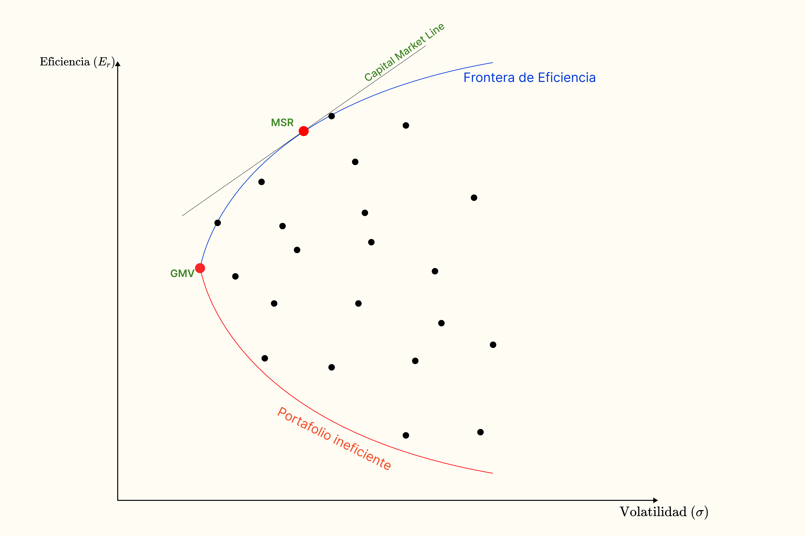

Imaginemos que de nuestros 9 activos hemos creado $100,000$ diferentes carteras, cada una con un peso diferente y queremos saber cuál de todas las carteras es la mejor en relación riesgo-rentabilidad.

$$S=\frac{R_a-r_f}{\sigma_a}$$

Donde,

* $S$: Índice de Sharpe (Sharpe Ratio).
* $R_a$: Rendimiento esperado. Es el retorno promedio de la inversión durante un periodo de tiempo, se expresa en porcentaje.
* $r_f$: Rendimiento libre de riesgo. Suelen ser los bonos del gobierno, donde su tasa de riesgo es cercano a cero.
* $\sigma_a$: Desviación estándar o volatilidad, se calcula usando retornos históricos.

Nos permite comparar el rendimiento de diferentes carteras por cada unidad de incremento de riesgo.

* $S<0$: La inversión tiene un desempeño peor que $r_f$.
* $0<S<1$: Inversión subóptima.
* $1<S<2$: Inversión buena.
* $3<S$: Inversión excelente (poco común).

## Frontera eficiente de Markowitz

Son las carteras que son las óptimas en relación rendimiento-riesgo. Todo portofolio que se encuentre en la frontera son las más eficiente, ya que no hay forma de mejorar el rendimiento sin asumir riesgo, las carteras que están debajo son ineficiente, porque con un mismo nivel de riesgo se obtiene un rendimiento menor.

Esto se obtiene después de realizar un análisis a nivel hitórico de todas las combinaciones posibles de los pesos de cada activo, más no es una predicción.



* ** Max Shape Ratio (MSR)** Es el portafolio con el máximo índice de Shape, es el punto de tangencia entre la frontera de eficiencia y el **Capitla Market Line** (teoría de **CAPM**):

* ** Global Minimum Volatility (GMV)**: Es el portafolio con la volatilidad mínima.

!!! success "MSR vs GSM"
    Si bien el **MSR** es el que brinda un mayor retorno por el riesgo tomado, suele ser más inconsistente que el **GSM**, esto es debido a que cuando lo aplicamos en la actuliadad los resultados varían mucho, debido a los múltiples factores del mercado, siendo el **GSM** más "conservadora" debido al poco riesgo que se toma, pero obtiendo un buen retorno.

## Ejemplos

Hemos creado una lista random de pesos para cada activo de nuestro portafolio, se muestra el datafram `pesos_aleatorios`:

| AAPL weight | MSFT weight |  XOM weight|  JNJ weight |  JPM weight | AMZN weight | GE weight | FB weight |  T weight |   Returns | Volatility |
|-------------|-------------|------------|-------------|-------------|-------------|-----------|-----------|-----------|-----------|------------|  
| 0.000053    | 0.263110    | 0.007022   | 0.040087    | 0.000027    | 0.024316    | 0.355899  | 0.299400  | 0.010087  | 0.127453  |  0.171565  | 
| 0.042360    | 0.034922    | 0.079355   | 0.043057    | 0.001435    | 0.202032    | 0.225924  | 0.362324  | 0.008590  | 0.138614  |  0.182723  | 
| 0.207824    | 0.002132    | 0.005982   | 0.041657    | 0.007498    | 0.406642    | 0.064929  | 0.229260  | 0.034075  | 0.155952  |  0.201185  | 
| 0.096565    | 0.016775    | 0.118409   | 0.037725    | 0.020013    | 0.045195    | 0.512282  | 0.153015  | 0.000020  | 0.118787  |  0.148958  | 
| 0.131309    | 0.002733    | 0.002360   | 0.047573    | 0.050633    | 0.289410    | 0.313717  | 0.157123  | 0.005141  | 0.138304  |  0.171473  | 

```py title="Portafolio MSR"
risk_free = 0 # Asumamos que es 0
pesos_aleatorios["Sharpe"]=(pesos_aleatorios["Returns"] - risk_free) / 
                            pesos_aleatorios["Volatility"] 
                           ) #(1)!

peso_sharpe=pesos_aleatorios[
                pesos_aleatorios["Sharpe"] == 
                pesos_aleatorios["Sharpe"].max()
                ] #(2)!

msr_pesos=peso_sharpe.iloc[0, :9] #(3)!

portafolio["RendimientoMSR"]=portafolio.iloc[:, :9] @ np.array(msr_pesos) #(4)!

cumulative_returns_plot(portafolio,
                columas=["Rendimiento_MCap", "RendimientoEW", "RendimientoMSR"]
                ) #(5)!
```

1. Se calcula los índices de Sharpe, mediante la fórmula mostrada.
2. Se obtiene la fila donde se está el **índice de shape máximo**.
3. Se escoge solo los **pesos** del índice de Shape Ratio máximo (**MSR**).
4. Se realiza el cálculo del rendimiento, **producto matricial** entre los **activos del portafolio** y la matriz de los **pesos**.
5. Se grafica los tres rendimientos.

<figure markdown="span">
  { width=100% }
  <figcaption>Retorno acumulado del MSR</figcaption>
</figure>

!!! note "Conclusión"
    Se puede ver en el gráfico que aún eligiendo la cartera con mayor **Sharpe Ratio** (MSR) nuestro rendimiento no es muy bueno, incluso es menor a la media, esto es porque los datos con que se trabajó fueron datos históricos y ahora se probó con datos "actuales", demostrando que el Sharpe Ratio no es una predicción sino una medida de comparativa.

    Desafortunadamente, la cartera MSR suele ser bastante errática. Aunque la cartera haya tenido un ratio de Sharpe histórico alto, eso no garantiza que la cartera tenga un buen ratio de Sharpe en el futuro.

```py title="Portafolio GMV"
gmv_pesos=pesos_aleatorios.sort_values(
                            'Volatility', ascending=True
                            ).iloc[0, :9] #(1)!

portafolio["RendimientoGMV"] = portafolio.iloc[:, :9] @ np.array(gmv_pesos) #(2)!

cumulative_returns_plot(portafolio, 
            columns=["Rendimiento_MCap", "RendimientoEW", 
            "RendimientoMSR", "RendimientoGMV"])
```

1. Se ordena respecto a la columna `Volatility` y tomamos los pesos la primera fila, esta es la que tiene la volatilidad más baja de todas.
2. Se calcula el rendimiento respecto a los pesos del **GMV**.

<figure markdown="span">
  { width=100% }
  <figcaption>Retorno acumulado del GMV</figcaption>
</figure>

!!! note "Conclusión"
    Podemos ver cómo la gráfica de la cartera **GMV** si bien tiene un retorno menor al **MSR**, se puede rescatar que no fluctua tan drásticamente como su contraparte, obtieniendo un rendimiento alrededor del $10\%$ y sin correr mucho riesgo. Aún así, sigue siendo menor a una estrategia simple como es el `RendimientoEW` (todos los pesos son iguales).