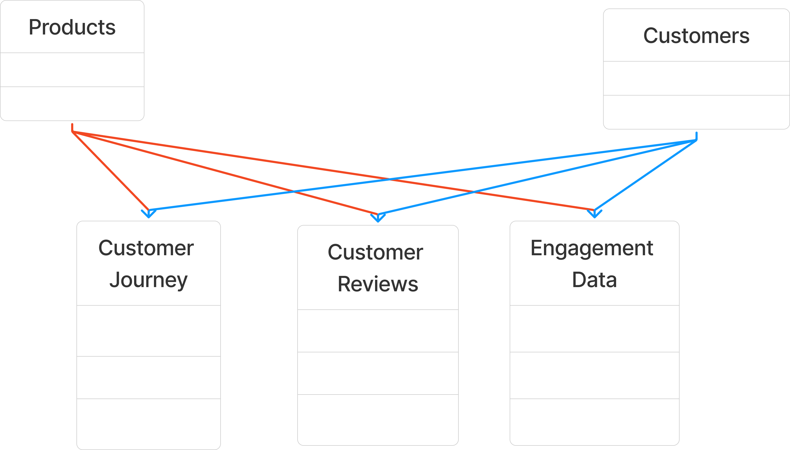

En esta etapa se realizará la limpieza de los datos, antes de poder trabajarlo en Power BI o Python. Además, se establecerá la estructura que tendrá nuestro modelo de datos para su futuro análisis.

De las tablas que tenemos escogeremos nuestras tablas de hechos y tablas de dimensiones.

{align=right}
Nuestas **tablas dimensiones** serán `Products` y `Customers`, este último estará unido con la tabla `Geography` para tener toda la información de los clientes en una sola tabla. Como las demás tablas tiene columnas numéricas que nos servirán para realizar las KPI, además de los `ID` de las demás tablas, los escogemos como **tablas de hechos**.

## Dimensiones

=== "DimCustomers"

    ```sql linenums="1"
    WITH DimCustomers AS
    (
        SELECT
            CustomerID,
            CustomerName,
            Gender,
            Age,
            G.Country AS Country,
            G.City AS City
        FROM customers C
        RIGHT JOIN geography G ON C.GeographyID=G.GeographyID
    )
    SELECT TOP(5) * FROM DimCustomers --(1)!
    ```

    1. Se une la tabla `Customer` con `Geography` mediante su columna `GeographyID` para obtener una donde se muestre toda la información relevante sobre los clientes.

    | CustomerID | CustomerName     | Gender  | Age | Country | City    |
    |------------|------------------|---------|-----|---------|---------|
    | 13         | David Wilson     | Male    | 50  | UK      | London  |
    | 20         | David Johnson    | Male    | 22  | UK      | London  |
    | 26         | Isabella Thomas  | Male    | 31  | UK      | London  |
    | 27         | John Rodriguez   | Male    | 23  | UK      | London  |
    | 42         | John Gonzalez    | Female  | 69  | UK      | London  |


=== "DimProduct"

    ```sql linenums="1" hl_lines="7-11"
    WITH DimProduct AS (
    SELECT
        ProductID,
        ProductName,
        Category,
        Price,
        CASE
            WHEN Price < 50 THEN 'Low'
            WHEN Price BETWEEN 50 AND 200 THEN 'Medium'
            ELSE 'High'
        END AS PriceCategory --(1)!
    FROM products
    )
    SELECT TOP(5) * FROM DimProduct
    ```

    1. Clasificación de los precios, una buena forma para hacer un análisis sobre los precios y poder segmentar los gustos de los clientes o realizar una campaña de marketing por cada grupo, esta es la forma fija (se establece un rango de precio para cada grupo). Hay otra alternativa, mediante percentiles `#!sql NTILE(n)`, separa el conjunto de datos en un número específico de grupos `n` (quartiles, quintiles, etc.) siendo la misma cantidad para cada grupo.

    | ProductID | ProductName      | Category  | Price    | PriceCategory |
    |-----------|------------------|-----------|----------|---------------|
    | 1         | Running Shoes    | Sports    | 223.75   | High          |
    | 2         | Fitness Tracker  | Sports    | 196.68   | Medium        |
    | 3         | Yoga Mat         | Sports    | 485.32   | High          |
    | 4         | Dumbbells        | Sports    | 26.21    | Low           |
    | 5         | Soccer Ball      | Sports    | 41.26    | Low           |

## Hechos

=== "FactCustomerReview"

    ```sql linenums="1" hl_lines="6 8-10"
    WITH FactCustomerReview AS
    (SELECT 
        ReviewID,
        CustomerID,
        ProductID,
        FORMAT(ReviewDate, 'd', 'es-PE') AS ReviewDate, --(1)!
        Rating,
        REPLACE(
            REPLACE(TRIM(ReviewText), '  ', ' '),
            '  ', ' ') AS ReviewText --(2)!
    FROM customer_reviews
    )
    SELECT TOP(5) * FROM customer_review_clean;
    ```

    1. Formateamos la fecha a un formato `dd/MM/yyyy`, como se usa en Perú.
    2. En la columna `ReviewText` hay filas con hasta 3 espacios en blanco, reducimos estos espacios a solo uno. Además, de haber espacios en el inicio y final, se elimina mediante `TRIM`.

    | ReviewID | CustomerID | ProductID |   ReviewDate | Rating | ReviewText                             |
    |----------|----------  |-----------|--------------|--------|----------------------------------------| 
    | 1	       |  77	    |     18    | 23/12/2023   |  3     |  Average experience, nothing special.  | 
    | 2	       |  80	    |     19    | 25/12/2024   |  5     |  The quality is top-notch.             |   
    | 3	       |  50	    |     13    | 26/01/2025   |  4     |  Five stars for the quick delivery.    |   
    | 4	       |  78	    |     15    | 21/04/2025   |  3     |  Good quality, but could be cheaper.   |   
    | 5	       |  64	    |     2	    | 16/07/2023   |  3     |  Average experience, nothing special.  |   

=== "FactEngagement"

    ```sql linenums="1" hl_lines="7 10-11 13-14"
    WITH FactEngagement AS (
    SELECT 
        EngagementID,
        ContentID,
        UPPER(ContentType) AS Category,
        Likes,
        FORMAT(EngagementDate, 'd', 'es-PE') AS EngagementDate, --(1)!
        CampaignID,
        ProductID,
        LEFT(ViewsClicksCombined, 
            CHARINDEX('-', ViewsClicksCombined)-1 --(2)!
            ) AS CountViews,
        RIGHT(ViewsClicksCombined, 
            LEN(ViewsClicksCombined) - CHARINDEX('-', ViewsClicksCombined) --(3)!
            ) AS CountClicks
    FROM engagement_data
    )
    SELECT TOP(5) * FROM FactEngagement;
    ```
    
    1. Formateamos la fecha a un formato `dd/MM/yyyy`, como se usa en Perú.
    2. La columna `ViewsClicksCombined` contiene los valores de los `Views` y `Clicks` que recibió nuestra publicicdad. Mediante `#!sql CHARINDEX()`, obtenemos el índice del delimitador (`-`), y mediante `#!sql LEFT` obtenemos, empezando desde la izquierda, el valor de las **Vistas**, restamos 1 (`#!sql CHARINDEX('-', ViewsClicksCombined)-1`) a la longitud para no agarrar el `-`.
    3. De igual forma, solo que empezamos desde la derecha (`RIGHT`), para obtener el punto de inicio, restamos la longitud toda y el índice del delimitador (`#!sql LEN(ViewsClicksCombined) - CHARINDEX('-', ViewsClicksCombined)`).

    | EngagementID | ContentID | Category    | Likes  | EngagementDate  | CampaignID | ProductID | CountViews  | CountClicks    |
    |--------------|-----------|-------------|--------|-----------------|------------|-----------|-------------|----------------|
    | 1            | 39        | BLOG        | 190    | 30/08/2023      | 1          | 9         | 1883        | 671            |
    | 2            | 48        | BLOG        | 114    | 28/03/2023      | 18         | 20        | 5280        | 532            |
    | 3            | 16        | VIDEO       | 32     | 8/12/2023       | 7          | 14        | 1905        | 204            |
    | 4            | 43        | VIDEO       | 17     | 21/01/2025      | 19         | 20        | 2766        | 257            |
    | 5            | 16        | NEWSLETTER  | 306    | 21/02/2024      | 6          | 15        | 5116        | 1524           |


=== "FactCustomerJourney"

    ```sql linenums="1" hl_lines="6 9-11 13-15 20"
    WITH FactCustomerJourney AS (
    SELECT 
        JourneyID,
        CustomerID,
        ProductID,
        FORMAT(VisitDate, 'd', 'es-PE') AS VisitDate, --(1)!
        UPPER(Stage) AS Stage,
        Action, 
        ROUND(
            ISNULL(Duration, AVG(Duration) OVER (PARTITION BY VisitDate)),
            2 --(2)!
        ) AS Duration,
        ROW_NUMBER() OVER (
            PARTITION BY JourneyID, CustomerID, ProductID, Stage, Action
            ORDER BY JourneyID --(3)!
        ) AS Steps
    FROM customer_journey
    )
    SELECT * FROM FactCustomerJourney
    WHERE Steps=1 --(4)!
    ```

    1. Formateamos la fecha a un formato `dd/MM/yyyy`, como se usa en Perú.
    2. En la columna `Duration` hay valores `#!sql NULL`, reemplazamos estos valores por el promedio que se tiene en el mismo día (`VisitDate`).
    3. Existen valores duplicados, podemos saber si es un duplicado cuando tienen el mismo `JourneyID - CustomerID - ProductID - Stage - Action`, como también se quiere conservar las demás columna, no podemos usar `#!sql DISTINCT` (este solo conserva las columnas que se le pasa). Lo que hará esta parte será enumerar las veces que se repita la fila.
    4. Solo conservamos las filas que son distintas, que estén categorizado como 1 en `Steps`, en los duplicados, uno de ellos tendrá el 1 y el otro tendrá 2, si hay más duplicados para una fila, tendrá 3, 4, etc.

    | JourneyID | CustomerID | ProductID | VisitDate   | Stage       | Action     | Duration   | Steps  |
    |-----------|------------|-----------|-------------|-------------|------------|------------|--------|
    | 1         | 64         | 18        | 10/06/2024  | CHECKOUT    | Drop-off   | 132.33     | 1      |
    | 2         | 94         | 11        | 9/07/2025   | CHECKOUT    | Drop-off   | 169.25     | 1      |
    | 3         | 34         | 8         | 14/06/2024  | PRODUCTPAGE | View       | 235        | 1      |    
    | 4         | 33         | 18        | 28/05/2025  | CHECKOUT    | Drop-off   | 12         | 1      |
    | 5         | 91         | 10        | 11/02/2023  | HOMEPAGE    | Click      | 156        | 1      |